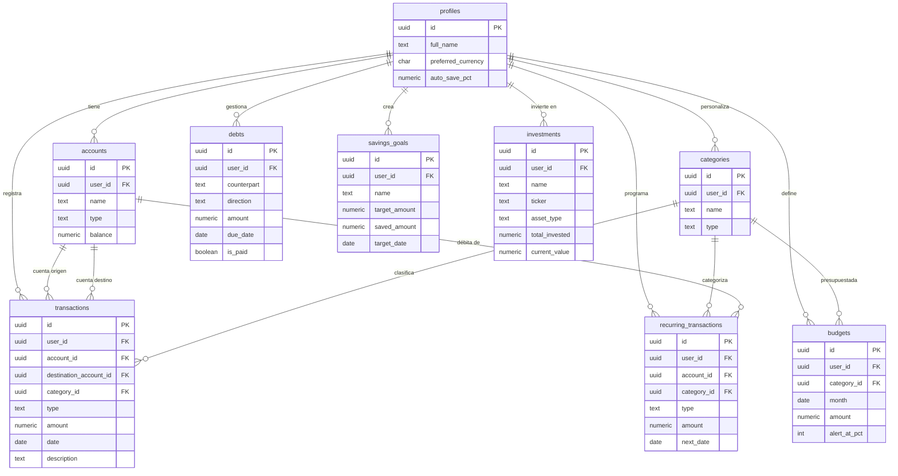

# Modelo de Base de Datos — Finanzas Personales

> React + Supabase · 4 pilares: Ingresos · Gastos · Ahorros · Inversión

---

## ¿Cuántas tablas necesitamos y por qué?

El sistema necesita exactamente **9 tablas**. Ni más, ni menos.
Cada tabla tiene un único propósito y juntas cubren los 4 pilares.

| #   | Tabla                    | Para qué sirve                                     |
| --- | ------------------------ | -------------------------------------------------- |
| 1   | `profiles`               | Datos del usuario autenticado                      |
| 2   | `accounts`               | Las cuentas donde vive el dinero                   |
| 3   | `categories`             | Clasificar ingresos y gastos                       |
| 4   | `transactions`           | **El corazón** — todo movimiento de dinero         |
| 5   | `budgets`                | Cuánto se permite gastar por categoría al mes      |
| 6   | `debts`                  | Deudas propias o de terceros                       |
| 7   | `savings_goals`          | Metas de ahorro con nombre y objetivo              |
| 8   | `investments`            | Activos del portafolio (acciones, cripto, etc.)    |
| 9   | `recurring_transactions` | Movimientos que se repiten (sueldo, Netflix, etc.) |

---

## Tabla 1 — `profiles`

**¿Para qué?** Guarda la información del usuario. Se crea automáticamente cuando alguien se registra. Solo hay un perfil por usuario.

**¿Por qué no usar la tabla de Supabase Auth directamente?** Porque `auth.users` es interna de Supabase y no se puede modificar libremente. `profiles` nos permite añadir los datos que necesitamos.

```sql
CREATE TABLE profiles (
  id                 UUID PRIMARY KEY REFERENCES auth.users(id) ON DELETE CASCADE,
  full_name          TEXT,
  avatar_url         TEXT,
  preferred_currency CHAR(3)  NOT NULL DEFAULT 'PEN',
  auto_save_pct      NUMERIC(5,2) DEFAULT 0,
  created_at         TIMESTAMPTZ NOT NULL DEFAULT now()
);
```

**Ejemplo de un registro real:**

| Columna              | Valor de ejemplo      | Explicación                                         |
| -------------------- | --------------------- | --------------------------------------------------- |
| `id`                 | `a1b2c3d4-...`        | El mismo UUID que Supabase Auth asignó al usuario   |
| `full_name`          | `Juan Pérez`          | Nombre que se muestra en la app                     |
| `avatar_url`         | `https://...jpg`      | Foto de perfil (puede venir de Google si usa OAuth) |
| `preferred_currency` | `PEN`                 | Moneda preferida del usuario (soles peruanos)       |
| `auto_save_pct`      | `20`                  | Ahorra automáticamente el 20% de cada ingreso       |
| `created_at`         | `2025-06-01 10:00:00` | Fecha de registro                                   |

---

## Tabla 2 — `accounts`

**¿Para qué?** Representa los "bolsillos" donde el usuario tiene dinero: su cuenta del banco, su efectivo, su tarjeta, su cuenta de ahorros. Cada transacción sale o entra a una cuenta específica.

**Ejemplo de uso real:** Juan tiene tres cuentas — BCP sueldo, efectivo de la billetera y una cuenta de ahorros en Interbank. Cada una tiene su propio saldo y se actualiza sola con cada transacción.

```sql
CREATE TABLE accounts (
  id         UUID    PRIMARY KEY DEFAULT gen_random_uuid(),
  user_id    UUID    NOT NULL REFERENCES profiles(id) ON DELETE CASCADE,
  name       TEXT    NOT NULL,
  type       TEXT    NOT NULL CHECK (type IN ('checking','savings','cash','credit_card','investment')),
  currency   CHAR(3) NOT NULL DEFAULT 'PEN',
  balance    NUMERIC(15,2) NOT NULL DEFAULT 0,
  color      CHAR(7),
  is_active  BOOLEAN NOT NULL DEFAULT true,
  created_at TIMESTAMPTZ NOT NULL DEFAULT now()
);
```

**Ejemplo — 3 cuentas del mismo usuario:**

| `name`              | `type`        | `currency` | `balance`  | `color`   |
| ------------------- | ------------- | ---------- | ---------- | --------- |
| `BCP Cuenta Sueldo` | `checking`    | `PEN`      | `2,450.00` | `#0070C0` |
| `Efectivo`          | `cash`        | `PEN`      | `80.00`    | `#16A34A` |
| `Interbank Ahorros` | `savings`     | `PEN`      | `4,300.00` | `#F59E0B` |
| `Tarjeta Visa BCP`  | `credit_card` | `PEN`      | `-350.00`  | `#DC2626` |

> El saldo de tarjeta de crédito es negativo porque representa lo que se debe.

---

## Tabla 3 — `categories`

**¿Para qué?** Clasifica cada transacción. Una categoría puede ser de tipo ingreso o de tipo gasto. Hay categorías predefinidas del sistema (visibles para todos) y categorías que el usuario puede crear.

**¿Cómo distinguir categorías del sistema de las del usuario?**
Si `user_id` es `NULL`, es del sistema. Si tiene un UUID, es de ese usuario.

```sql
CREATE TABLE categories (
  id        UUID PRIMARY KEY DEFAULT gen_random_uuid(),
  user_id   UUID REFERENCES profiles(id) ON DELETE CASCADE,
  name      TEXT NOT NULL,
  type      TEXT NOT NULL CHECK (type IN ('income','expense')),
  icon      TEXT,
  color     CHAR(7),
  is_active BOOLEAN NOT NULL DEFAULT true
);
```

**Ejemplo — categorías del sistema (user_id = NULL):**

| `name`            | `type`    | `icon` | `color`   |
| ----------------- | --------- | ------ | --------- |
| `Salario`         | `income`  | `💼`   | `#16A34A` |
| `Freelance`       | `income`  | `💻`   | `#0284C7` |
| `Alimentación`    | `expense` | `🛒`   | `#DC2626` |
| `Transporte`      | `expense` | `🚗`   | `#D97706` |
| `Vivienda`        | `expense` | `🏠`   | `#7C3AED` |
| `Salud`           | `expense` | `❤️`   | `#EC4899` |
| `Entretenimiento` | `expense` | `🎬`   | `#9333EA` |

**Ejemplo — categoría personalizada de un usuario:**

| `user_id`   | `name`     | `type`    |
| ----------- | ---------- | --------- |
| `a1b2c3...` | `Mascotas` | `expense` |

---

## Tabla 4 — `transactions` ⭐

**¿Para qué?** Es la tabla más importante. Aquí se registra **absolutamente todo movimiento de dinero**: ingresos, gastos y transferencias entre cuentas propias. Todo lo que ve el dashboard viene de aquí.

**Tres tipos de transacción:**

- `income` → dinero que entra a una cuenta (ej: cobré mi sueldo)
- `expense` → dinero que sale de una cuenta (ej: compré comida)
- `transfer` → dinero que se mueve entre mis propias cuentas (ej: pasé plata de BCP a ahorros)

```sql
CREATE TABLE transactions (
  id                     UUID    PRIMARY KEY DEFAULT gen_random_uuid(),
  user_id                UUID    NOT NULL REFERENCES profiles(id) ON DELETE CASCADE,
  account_id             UUID    NOT NULL REFERENCES accounts(id),
  destination_account_id UUID    REFERENCES accounts(id),
  -- solo se llena en transferencias
  category_id            UUID    REFERENCES categories(id) ON DELETE SET NULL,
  type                   TEXT    NOT NULL CHECK (type IN ('income','expense','transfer')),
  amount                 NUMERIC(15,2) NOT NULL CHECK (amount > 0),
  description            TEXT,
  date                   DATE    NOT NULL,
  receipt_url            TEXT,
  -- URL del comprobante guardado en Supabase Storage
  is_recurring           BOOLEAN NOT NULL DEFAULT false,
  created_at             TIMESTAMPTZ NOT NULL DEFAULT now()
);
```

**Ejemplo — 5 transacciones reales de Juan en junio:**

| `type`     | `account_id`                   | `category`   | `amount`   | `description`          | `date`       |
| ---------- | ------------------------------ | ------------ | ---------- | ---------------------- | ------------ |
| `income`   | BCP Sueldo                     | Salario      | `3,500.00` | Sueldo junio           | `2025-06-15` |
| `expense`  | BCP Sueldo                     | Alimentación | `185.00`   | Plaza Vea              | `2025-06-14` |
| `expense`  | Efectivo                       | Transporte   | `12.00`    | Pasaje combi           | `2025-06-13` |
| `transfer` | BCP Sueldo → Interbank Ahorros | —            | `700.00`   | Ahorro mensual         | `2025-06-15` |
| `income`   | BCP Sueldo                     | Freelance    | `800.00`   | Proyecto web cliente X | `2025-06-10` |

> En la transferencia, `account_id = BCP Sueldo` y `destination_account_id = Interbank Ahorros`.

---

## Tabla 5 — `budgets`

**¿Para qué?** Define cuánto se permite gastar en cada categoría durante un mes. Si el usuario pone S/500 de presupuesto para Alimentación en junio, la app le avisa cuando se acerca o supera ese límite.

```sql
CREATE TABLE budgets (
  id           UUID    PRIMARY KEY DEFAULT gen_random_uuid(),
  user_id      UUID    NOT NULL REFERENCES profiles(id) ON DELETE CASCADE,
  category_id  UUID    NOT NULL REFERENCES categories(id) ON DELETE CASCADE,
  month        DATE    NOT NULL,
  -- siempre el primer día del mes: 2025-06-01
  amount       NUMERIC(15,2) NOT NULL CHECK (amount > 0),
  alert_at_pct INTEGER NOT NULL DEFAULT 80,
  -- alerta cuando se usa el 80% del presupuesto
  created_at   TIMESTAMPTZ NOT NULL DEFAULT now(),
  UNIQUE(user_id, category_id, month)
  -- no puede haber dos presupuestos del mismo mes y categoría
);
```

**Ejemplo — presupuestos de Juan para junio 2025:**

| `category`      | `month`      | `amount` | `alert_at_pct` | Gasto real | Estado          |
| --------------- | ------------ | -------- | -------------- | ---------- | --------------- |
| Alimentación    | `2025-06-01` | `800.00` | `80`           | `802.00`   | ❌ Excedido     |
| Transporte      | `2025-06-01` | `500.00` | `80`           | `380.00`   | ✅ OK (76%)     |
| Entretenimiento | `2025-06-01` | `300.00` | `80`           | `245.00`   | ⚠️ Alerta (81%) |
| Vivienda        | `2025-06-01` | `600.00` | `80`           | `400.00`   | ✅ OK (66%)     |

> El "gasto real" no se guarda aquí — se calcula sumando las `transactions` de esa categoría y ese mes.

---

## Tabla 6 — `debts`

**¿Para qué?** Registra deudas: lo que el usuario le debe a alguien, o lo que alguien le debe a él. No reemplaza a `transactions` — es un recordatorio con monto, vencimiento y estado.

**Ejemplo de uso:** Juan le prestó S/200 a su amigo Carlos, y tiene una deuda pendiente con la veterinaria por S/150.

```sql
CREATE TABLE debts (
  id           UUID    PRIMARY KEY DEFAULT gen_random_uuid(),
  user_id      UUID    NOT NULL REFERENCES profiles(id) ON DELETE CASCADE,
  counterpart  TEXT    NOT NULL,
  -- nombre de la persona o entidad
  direction    TEXT    NOT NULL CHECK (direction IN ('i_owe','they_owe_me')),
  -- 'i_owe' = yo debo, 'they_owe_me' = me deben
  amount       NUMERIC(15,2) NOT NULL CHECK (amount > 0),
  currency     CHAR(3) NOT NULL DEFAULT 'PEN',
  description  TEXT,
  due_date     DATE,
  is_paid      BOOLEAN NOT NULL DEFAULT false,
  paid_at      TIMESTAMPTZ,
  created_at   TIMESTAMPTZ NOT NULL DEFAULT now()
);
```

**Ejemplo — deudas de Juan:**

| `counterpart`           | `direction`   | `amount` | `description`            | `due_date`   | `is_paid` |
| ----------------------- | ------------- | -------- | ------------------------ | ------------ | --------- |
| `Carlos Ríos`           | `they_owe_me` | `200.00` | Préstamo para emergencia | `2025-07-01` | `false`   |
| `Veterinaria San Borja` | `i_owe`       | `150.00` | Operación de Pelusa      | `2025-06-30` | `false`   |
| `María (prima)`         | `i_owe`       | `50.00`  | Almuerzo cumpleaños      | —            | `true`    |

---

## Tabla 7 — `savings_goals`

**¿Para qué?** Define metas de ahorro concretas: "quiero juntar S/2,500 para ir a Cusco antes de diciembre". La app muestra el progreso y cuánto falta.

```sql
CREATE TABLE savings_goals (
  id             UUID    PRIMARY KEY DEFAULT gen_random_uuid(),
  user_id        UUID    NOT NULL REFERENCES profiles(id) ON DELETE CASCADE,
  account_id     UUID    REFERENCES accounts(id) ON DELETE SET NULL,
  -- cuenta donde se acumula este ahorro (opcional)
  name           TEXT    NOT NULL,
  target_amount  NUMERIC(15,2) NOT NULL CHECK (target_amount > 0),
  saved_amount   NUMERIC(15,2) NOT NULL DEFAULT 0,
  currency       CHAR(3) NOT NULL DEFAULT 'PEN',
  target_date    DATE,
  status         TEXT    NOT NULL DEFAULT 'active'
                         CHECK (status IN ('active','completed','cancelled')),
  icon           TEXT,
  color          CHAR(7),
  created_at     TIMESTAMPTZ NOT NULL DEFAULT now(),
  updated_at     TIMESTAMPTZ NOT NULL DEFAULT now()
);
```

**Ejemplo — metas de Juan:**

| `name`                | `target_amount` | `saved_amount` | `target_date` | `status`    |
| --------------------- | --------------- | -------------- | ------------- | ----------- |
| `Vacaciones Cusco`    | `2,500.00`      | `1,700.00`     | `2025-12-20`  | `active`    |
| `Fondo de emergencia` | `10,000.00`     | `4,000.00`     | —             | `active`    |
| `Laptop nueva`        | `3,000.00`      | `3,000.00`     | `2025-05-01`  | `completed` |
| `Viaje a Colombia`    | `5,000.00`      | `200.00`       | `2026-03-01`  | `active`    |

> `saved_amount` se actualiza cada vez que el usuario registra una transferencia hacia la cuenta vinculada a esa meta.

---

## Tabla 8 — `investments`

**¿Para qué?** Registra cada activo del portafolio de inversión: acciones, ETFs, criptomonedas, fondos, etc. Muestra cuánto se invirtió vs cuánto vale ahora, y el rendimiento porcentual.

```sql
CREATE TABLE investments (
  id             UUID    PRIMARY KEY DEFAULT gen_random_uuid(),
  user_id        UUID    NOT NULL REFERENCES profiles(id) ON DELETE CASCADE,
  name           TEXT    NOT NULL,
  ticker         TEXT,
  -- símbolo bursátil, ej: AAPL, BTC, VOO
  asset_type     TEXT    NOT NULL
                         CHECK (asset_type IN ('stock','etf','crypto','bond','fund','real_estate','other')),
  currency       CHAR(3) NOT NULL DEFAULT 'USD',
  total_invested NUMERIC(15,2) NOT NULL DEFAULT 0,
  -- cuánto he puesto en total
  current_value  NUMERIC(15,2) NOT NULL DEFAULT 0,
  -- cuánto vale hoy (se actualiza manualmente o con API)
  notes          TEXT,
  is_active      BOOLEAN NOT NULL DEFAULT true,
  created_at     TIMESTAMPTZ NOT NULL DEFAULT now(),
  updated_at     TIMESTAMPTZ NOT NULL DEFAULT now()
);
```

**Ejemplo — portafolio de Juan:**

| `name`                | `ticker` | `asset_type` | `total_invested` | `current_value` | Ganancia       |
| --------------------- | -------- | ------------ | ---------------- | --------------- | -------------- |
| `Apple Inc.`          | `AAPL`   | `stock`      | `$800.00`        | `$943.00`       | +$143 (+17.9%) |
| `Vanguard S&P 500`    | `VOO`    | `etf`        | `$1,200.00`      | `$1,320.00`     | +$120 (+10%)   |
| `Bitcoin`             | `BTC`    | `crypto`     | `$500.00`        | `$478.00`       | -$22 (-4.4%)   |
| `Fondo Sura Moderado` | —        | `fund`       | `$600.00`        | `$638.00`       | +$38 (+6.3%)   |

> La ganancia (`current_value - total_invested`) se calcula en la app, no se guarda en la tabla.

---

## Tabla 9 — `recurring_transactions`

**¿Para qué?** Guarda las plantillas de movimientos que se repiten: el sueldo que entra cada 15, Netflix que sale cada 1 del mes, el alquiler que se paga cada fin de mes. La app usa esto para generar las transacciones automáticamente en la fecha correcta.

```sql
CREATE TABLE recurring_transactions (
  id          UUID    PRIMARY KEY DEFAULT gen_random_uuid(),
  user_id     UUID    NOT NULL REFERENCES profiles(id) ON DELETE CASCADE,
  account_id  UUID    NOT NULL REFERENCES accounts(id),
  category_id UUID    REFERENCES categories(id) ON DELETE SET NULL,
  type        TEXT    NOT NULL CHECK (type IN ('income','expense')),
  amount      NUMERIC(15,2) NOT NULL CHECK (amount > 0),
  description TEXT    NOT NULL,
  interval    TEXT    NOT NULL
              CHECK (interval IN ('daily','weekly','biweekly','monthly','yearly')),
  next_date   DATE    NOT NULL,
  -- próxima fecha en que se debe generar la transacción
  end_date    DATE,
  -- si es NULL, no tiene fin (ej: sueldo indefinido)
  is_active   BOOLEAN NOT NULL DEFAULT true,
  created_at  TIMESTAMPTZ NOT NULL DEFAULT now()
);
```

**Ejemplo — transacciones recurrentes de Juan:**

| `description`    | `type`    | `amount`   | `interval` | `next_date`  | `end_date`   |
| ---------------- | --------- | ---------- | ---------- | ------------ | ------------ |
| `Sueldo empresa` | `income`  | `3,500.00` | `monthly`  | `2025-07-15` | —            |
| `Netflix`        | `expense` | `37.90`    | `monthly`  | `2025-07-01` | —            |
| `Spotify`        | `expense` | `19.90`    | `monthly`  | `2025-07-01` | —            |
| `Alquiler dpto`  | `expense` | `1,200.00` | `monthly`  | `2025-07-01` | —            |
| `Gym`            | `expense` | `89.00`    | `monthly`  | `2025-07-05` | `2025-12-31` |

> La app corre un proceso diario que revisa si `next_date = hoy`, crea la transacción y actualiza `next_date` al siguiente periodo.

---

## Diagrama entidad-relación



---

## Resumen visual del flujo de datos

```
Usuario
  │
  ├─── Se registra ──────────────────────► profiles (1 fila)
  │
  ├─── Crea cuentas ─────────────────────► accounts (N filas)
  │         │
  ├─── Registra movimientos ─────────────► transactions ◄── categories
  │         │                                    │
  │         │ actualiza balance                  │ se agrupa por mes
  │         ▼                                    ▼
  │      accounts.balance              budgets (¿excede límite?)
  │
  ├─── Define metas ─────────────────────► savings_goals
  │
  ├─── Registra deudas ──────────────────► debts
  │
  ├─── Registra inversiones ─────────────► investments
  │
  └─── Programa recurrentes ─────────────► recurring_transactions
                                                │
                                         (cron diario genera)
                                                │
                                                ▼
                                          transactions
```

---

## Lo que calcula la app (no se guarda, se computa)

Estos datos **no necesitan tabla propia** porque se calculan en tiempo real sumando `transactions`:

| Métrica                | Cómo se calcula                                          |
| ---------------------- | -------------------------------------------------------- |
| Total ingresos del mes | `SUM(amount) WHERE type='income' AND mes=actual`         |
| Total gastos del mes   | `SUM(amount) WHERE type='expense' AND mes=actual`        |
| Balance neto           | `ingresos - gastos`                                      |
| Tasa de ahorro         | `(ingresos - gastos) / ingresos × 100`                   |
| % uso de presupuesto   | `gastos_categoria / budget.amount × 100`                 |
| Ganancia inversión     | `investments.current_value - investments.total_invested` |
| Progreso de meta       | `savings_goals.saved_amount / target_amount × 100`       |

---

_9 tablas · React + Supabase · Sistema de finanzas personales_
